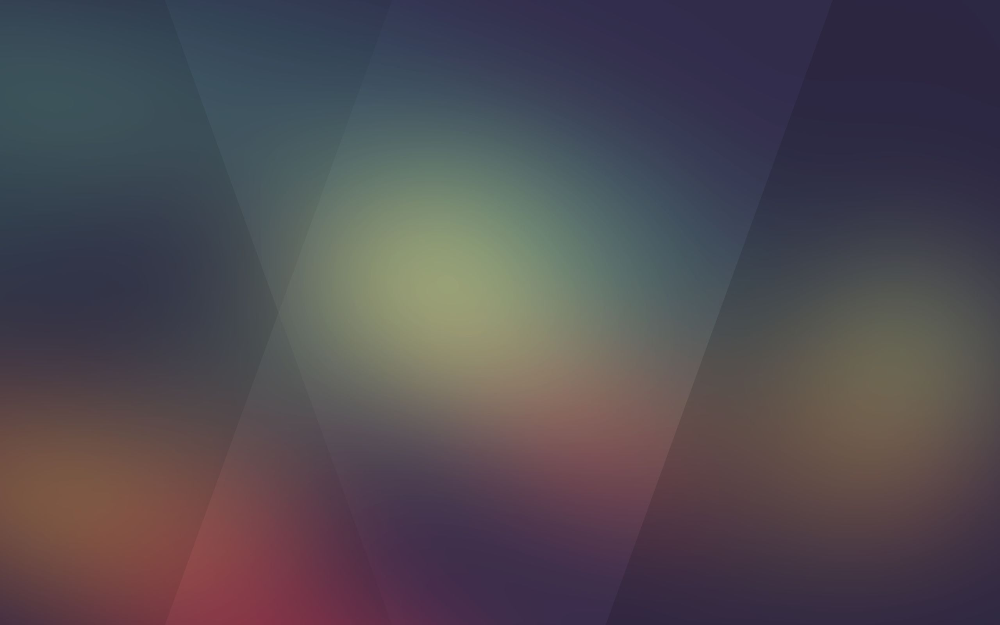

# Styleguide: ADC / Citrix Gateway UI (DC319)

## Содержание

1. Введение и охват
2. Инвентарь файлов (полный аудит)
3. Дизайн-токены
4. Типографика
5. Layout, сетка, брейкпоинты
6. Компоненты и состояния
7. Иконография, изображения, спрайты
8. Поведение и анимации
9. Accessibility и UX-наблюдения
10. Несоответствия и риски
11. Быстрый чеклист для воспроизведения дизайна

## Введение и охват

Этот стайлгайд построен по локальному снапшоту страницы `DC319.html` и связанных ресурсов из папки `ADC design`.

- Базовая архитектура UI: Citrix Receiver / Gateway WebUI.
- Основные визуальные правила: `ctxs.large-ui.min.css`.
- Кастомизация брендинга/темы: `theme.css` + inline-стили в `DC319.html`.
- Кастомные сценарии интерфейса (выбор клиента, EPA, OTP и т.д.): `nsg-setclient.js`, `nsg-epa.js`, `ns-nfactor.js`.

## Инвентарь файлов (полный аудит)

Ниже перечислены все файлы из экспортированной папки и их роль в дизайне.

| Файл | Тип | Роль |
|---|---|---|
| `DC319.html` | HTML | Главный каркас всех экранов (auth/home/dialog/plugin-assistant), inline-override стилей и инлайн-спрайтов (base64) |
| `DC319_files/ctxs.large-ui.min.css` | CSS | Основная дизайн-система (типографика, layout, компоненты, responsive, спрайты) |
| `DC319_files/theme.css` | CSS | Тема/брендинг: акцент, хедер, фоновые цвета, локальные overrides |
| `DC319_files/init.js.Без названия` | JS | Выбор размера UI (`small/medium/large`), подключение CSS, загрузка custom-ресурсов |
| `DC319_files/nsg-setclient.js.Без названия` | JS | Кастомные экраны выбора клиента, персональные закладки, VPN UI, логика меню |
| `DC319_files/nsg-epa.js.Без названия` | JS | UI потока Endpoint Analysis (EPA): прогресс, ошибки, download/retry |
| `DC319_files/ns-nfactor.js.Без названия` | JS | nFactor UI-расширения: OTP, CAPTCHA, push/OTP, дополнительные формы |
| `DC319_files/ctxs.strings.ru.js.Без названия` | JS | Большой словарь локализации (RU), тексты UI |
| `DC319_files/strings.ru.js.Без названия` | JS | Подгрузка кастомного словаря `/custom/strings.ru.json` |
| `DC319_files/ctxs.core.min.js.Без названия` | JS | Core-движок CTXS (auth/store/events/bootstrap/client manager) |
| `DC319_files/ctxs.webui.min.js.Без названия` | JS | WebUI-слой CTXS (категории, app tiles, launch flow, UI-модели) |
| `DC319_files/saved_resource.html` | HTML | Пустой служебный iframe |
| `DC319_files/jquery.min.js.Без названия` | JS | Библиотека |
| `DC319_files/jquery-ui.min.js.Без названия` | JS | Библиотека |
| `DC319_files/jquery.ui.touch-punch.min.js.Без названия` | JS | Библиотека |
| `DC319_files/jquery-migrate.min.js.Без названия` | JS | Библиотека |
| `DC319_files/jquery.dotdotdot.min.js.Без названия` | JS | Библиотека |
| `DC319_files/velocity.min.js.Без названия` | JS | Библиотека анимаций |
| `DC319_files/slick.min.js.Без названия` | JS | Слайдер |
| `DC319_files/hammer.min.js.Без названия` | JS | Touch-жесты |
| `DC319_files/elliptic.min.js.Без названия` | JS | Криптография (EC) |

### Важное наблюдение по комплектности

В `DC319.html` подключаются `style.css` и `script.js` как `customStyle`/`customScript`, но в экспортированной папке эти файлы отсутствуют. Это означает, что часть кастомных правок могла быть не сохранена в дамп.

## Дизайн-токены

### Цветовая палитра (ключевая)

| Токен | Значение | Где используется |
|---|---|---|
| `accent-primary` | `#02A1C1` | Primary buttons, ссылки, активные элементы, highlight |
| `header-bg` | `#574F5B` | Хедеры и loading-screen |
| `overlay-surface` | `rgba(63, 54, 67, 0.8)` | Подложка auth/content-area на фоне |
| `canvas-light` | `#F9F9F9` | Фон контентных секций store/appInfo |
| `text-primary-dark` | `#333` / `rgb(102, 102, 102)` | Заголовки/имена приложений |
| `text-secondary` | `#999999` / `#9A9A9A` | Подписи, вторичный текст, лейблы |
| `text-inverse` | `#FFFFFF` | Текст на тёмных фонах |
| `border-neutral` | `#CCCCCC` | Разделители, границы тулбаров, полей |
| `overlay-mask` | `rgba(238,238,238,0.7)` | Оверлей модальных/меню |
| `disabled-accent` | `rgba(2,161,193,0.2)` + `#3E5962` | disabled state кнопок |

### Служебные/дополнительные цвета

- Ошибка/alert: `#EC5026`, `#C00`
- Фон страницы web-screen: `#161619` + `assets/images/ReceiverFullScreenBackground.jpg`
- Карточки/блоки VPN выбора: `rgba(255,255,255,0.1)` hover

## Типографика

### Font stack

Базовый стек:

`"Helvetica Neue", "Segoe UI", Helvetica, Arial, "Lucida Grande", sans-serif`

### Размеры шрифтов (наблюдаемые уровни)

- 12px: secondary labels, helper text, часть toolbar/search
- 13px: popup body/meta
- 14px: базовый UI text, ссылки, detail text
- 16px: кнопки, toolbar элементы, section text
- 17px: label/input в desktop auth-форме
- 18px: h1/auth titles/main text
- 20px+: отдельные заголовки/tabs
- 22px: `appInfoName`, крупные заголовки popup/dialog
- 34px/35px: заголовки bundle hero

### Font weight

- `300` (light) — основная «фирменная» плотность текстов в auth/web-screen
- `500` — кнопки/акцентные подписи
- `bold` — отдельные служебные подписи и counters

## Layout, сетка, брейкпоинты

### Режимы интерфейса (из `init.js`)

- `large`: `minimumAvailableWidth >= 768`
- `medium`: `600 <= minimumAvailableWidth < 768`
- `small`: `< 600`

В HTML на момент снапшота выставлено: `class="large largeTiles ..."` (desktop/tablet layout).

### Ключевые размеры

- Header: `76px`
- Toolbar (large): `48px`
- Основная кнопка/инпут высота: `44px`
- App icon tile: `60x60` (card), `96x96` (appInfo)
- Logo area: `170x40` (base), кастом до `200x76`

### Breakpoints в CSS

- `max-width: 1009px` (переход логон-лого/адаптация)
- `max-width: 609px` (phone layout)
- language-specific compacting: `max-width: 910/875/830`
- retina правила через `(-webkit-min-device-pixel-ratio:1.25)` / `(min-resolution:120dpi)`

## Компоненты и состояния

### 1) Экран логина (explicit auth)

Структура:

- `.web-screen` (фон + full-screen image)
- `.credentialform`
- Поля `#login`, `#passwd`
- CTA `#nsg-x1-logon-button.button.default`

Стиль:

- Тёмная полупрозрачная центральная подложка
- Светлый текст, акцентная кнопка `#02A1C1`
- Логотип вверху (замещён кастомным `/vpn/media/...`)
- Фоновое изображение страницы входа: `assets/images/ReceiverFullScreenBackground.jpg`

Фон страницы входа (локальная копия):

Состояния:

- Ошибка/инфо/confirmation через label-классы и иконки
- Disabled кнопки: приглушённый accent + серый текст
- Focus: dotted outline для части interactive элементов

### 2) Верхний хедер / навигация home

- Фон: `#574F5B`
- Toggle-вкладки (Favorites/Desktop/Apps/Tasks)
- User dropdown справа, settings arrow из `view-sprite`
- Hover: повышение opacity + полупрозрачная белая подложка

### 3) Toolbar + поиск

- Светлая панель (`#F9F9F9`) с нижней границей
- Search input (large): 192x30, иконка лупы слева
- Search clear button появляется только при тексте (`with-text`)

### 4) App tiles / folders

- Large tiles: карточка ~`254x125` c вертикальной логикой иконка/имя/категория/действие
- Разделитель справа у карточки (`border-right`)
- Folder icon фиксированный 60x60, имя/count

Состояния:

- launch-ready overlay с иконкой ready
- operation-in-progress suppresses hover-action

### 5) App Info панель

- Заголовок с крупной иконкой (96x96)
- Имя + категория/хост
- Ряд action-кнопок с `theme-highlight-border-color`

Кнопки:

- `Open`, `Restart`, `Request`, `Cancel Request`, `Add`, `Remove`, custom `Delete` (добавляется JS)

### 6) Попапы и диалоги

- `.popup` белый фон, тень, border-radius (часто обнуляется)
- Затемняющий overlay `rgba(238,238,238,0.7)`
- MessageBox и AboutBox имеют собственные размеры/отступы в large mode

### 7) Специализированные экраны

- Plugin assistant (detect/download/validate)
- EPA flow (прогресс-бар, retry, error detail table)
- Client choices (Network/Clientless/ICA cards)
- OTP management UI (таблица устройств, QR, action buttons)

## Иконография, изображения, спрайты

### Спрайты

- `view-sprite` (`viewSprite.png`) — меню, иконки хедера, стрелки
- `theme-highlight-sprite` (`actionSprite.png`) — back/add/next-prev

### Логотипы и брендинг

Переопределено на кастомные ассеты:

- `/vpn/media/citrixgateway_logo_white.png`
- `/vpn/media/citrixgateway_logo_black.png`
- `/vpn/media/NetScaler-AAA-logo-center.png`

### Фоны

- Fullscreen background: `assets/images/ReceiverFullScreenBackground.jpg`
- Bundle backgrounds (`bundle_background_0X.jpg`, `bundle_banner_0X.jpg`)

### Локальные изображения в папке

Отдельных `.png/.jpg/.gif` файлов в экспорте нет; используются:

- относительные пути к серверным ассетам,
- и встроенные base64 data-URI в HTML/CSS.

## Поведение и анимации

- `slick` для bundle-каруселей
- Popup transitions: fade/visibility (~1s)
- Поиск/панели с dynamic show/hide
- Прогресс EPA с pseudo-animated bar
- Часть эффектов реализуется через `velocity.js`

## Accessibility и UX-наблюдения

Плюсы:

- Явные `role="alertdialog"` и aria-описания в ключевых экранах
- Фокус-рамки и keyboard-ориентированная разметка в ряде элементов
- Локализация RU полная и системная

Риски:

- Много `<a href="#">` вместо semantic button
- Интенсивный reliance на JS (noscript — только fallback)
- Длинные/complex flows для plugin/EPA могут быть тяжёлыми UX-wise

## Несоответствия и риски

1. **Неполный дамп custom-ресурсов**  
   В HTML подключены `style.css` и `script.js`, которых нет в экспортированной папке.

2. **Потенциально некорректное CSS-правило**  
   В `theme.css`: `.button.default:hover { background: ; }` — пустое значение.

3. **Конкуренция overrides**  
   `theme.css` после core CSS может переопределять типографику (`detail-text`, `main-text`) и приводить к разнице desktop/expected tokens.

4. **Сильная зависимость от runtime-условий**  
   UI/flows завязаны на cookies, query params, plugin detection, user agent, server responses.

## Быстрый чеклист для воспроизведения дизайна

1. Базовый визуальный каркас:
   - Header `#574F5B`
   - Accent `#02A1C1`
   - Surface `#F9F9F9`
   - Dark overlay `rgba(63,54,67,.8)`

2. Типографика:
   - Base stack: `Helvetica Neue / Segoe UI / Arial`
   - Sizes: 12/14/16/18/22
   - Weights: 300/500/bold

3. Компоненты:
   - 44px controls
   - 76px top header
   - 48px toolbar
   - Tiles 60px icon + text block + action

4. Responsive:
   - `large >= 768`
   - `medium 600-767`
   - `small <= 599`

5. Обязательные состояния:
   - default / hover / disabled / focus
   - launch-ready / operation-in-progress
   - popup overlay + dialog state

